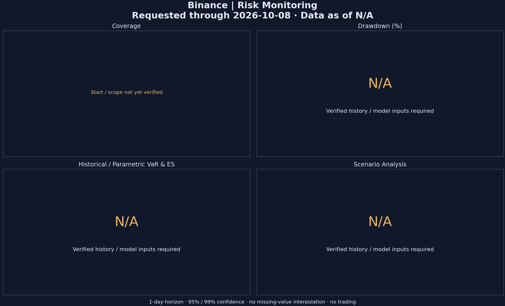

# Binance 收益与风险监控

状态：**incomplete**。请求覆盖 起点待核实 至 2026-10-08；实际最新数据时间：N/A。

已核实完整日终值：0 / 0；有效资金流调整日收益：0。

- 900 principal start, currency, account scope and evidence not verified
- external cashflow coverage unverified; investment-return risk metrics N/A
- no complete verified end-of-day account value history

## 指标口径

- 日收益：Modified Dietz；现金流完整性未核实时不计算投资收益。
- Historical VaR：损失经验分布 inverse CDF；ES：最差尾部的分数样本加权平均。
- Parametric VaR / ES：正态模型，保留样本均值；损失分位数可为负，不截断为零。
- 风险期限 1 日；95%、97.5%、99% 分别计算。滚动窗 30/90/252 个有效观测；少于 30 个观测标 N/A，薄尾样本标 provisional。
- Schwab 年化 252、Binance 年化 365；无风险利率未指定时 Sharpe 标 N/A；Sortino 默认目标收益 0%。
- 不跨缺失交易日计算单日收益；回撤仅使用最近连续有效段，说明覆盖期。未调整资金流的 Account Value 变化仅为代理，不代表投资收益。
- 当前组合情景重估和 VaR 预测回测缺少有效输入，标 N/A，不制造数据。

参考：[BIS ES 定义](https://www.bis.org/bcbs/publ/d457_inbrief.pdf)、[Binance API 官方文档](https://developers.binance.com/docs/wallet/account/daily-account-snapshoot)。

成交表为空且 verified_trade_records 为 null 表示未采集，不能解释为零成交；回测文件未作为实盘输入。
